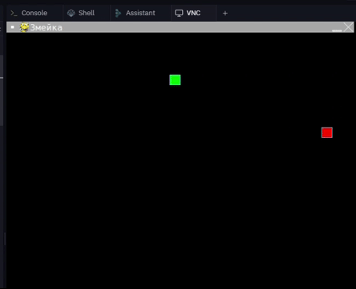

# Змейка

### 1. Скопируйте репозиторий:
```bash
git@github.com:ValeryRabchenyuk/the_snake.git
```
### 2. Установите зависимости:
```bash
pip install -r requirements.txt
```
### 3. Запускайте игру:
```bash
python the_snake.py
```


